## Documentation of Projec 1

### Apache Installation

`sudo apt update`

`sudo apt install apache2`

`sudo systemctl status apache2`

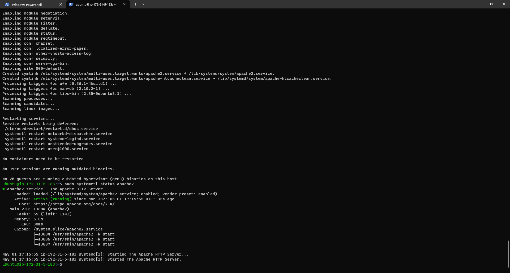

`curl http://localhost:80`

`http://<3.15.145.37:80`

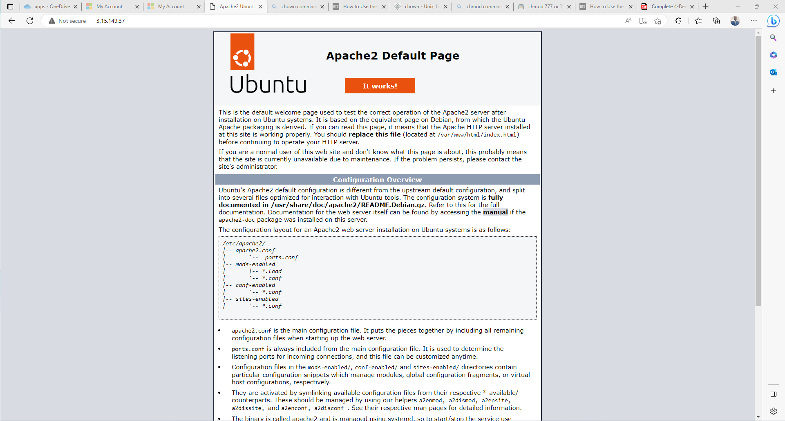

### MySQL setup

`sudo apt install mysql-server`

`sudo mysql`

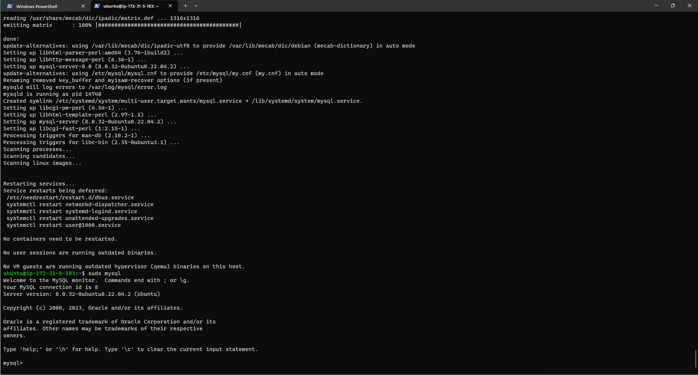

`ALTER USER 'root'@'localhost' IDENTIFIED WITH mysql_native_password BY 'PassWord.1';`

`mysql> exit`

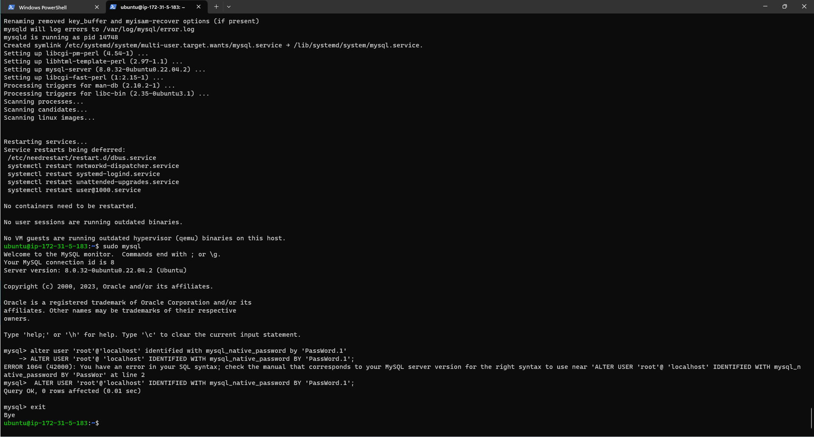

`sudo mysql_secure_installation`

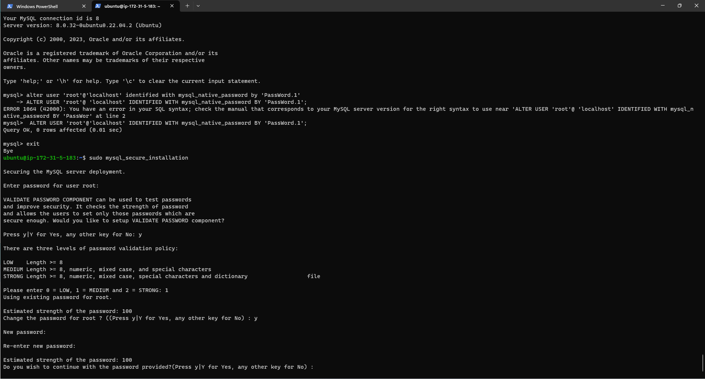
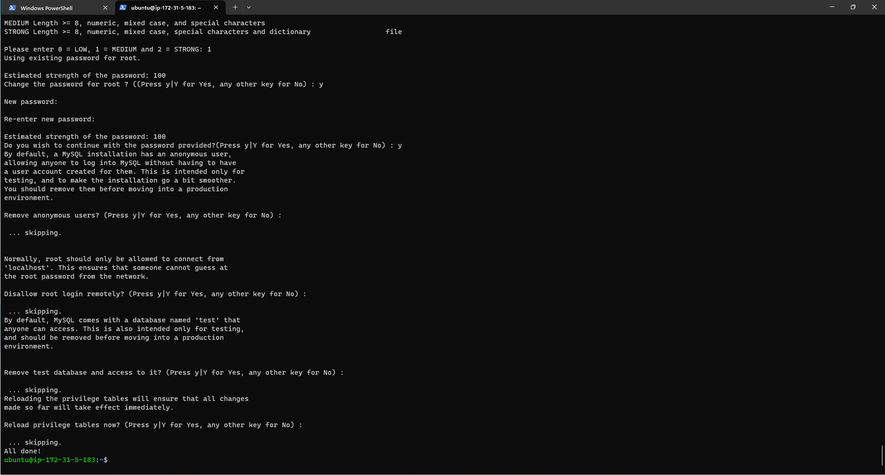

### PHP Installation

`sudo apt install php libapache2-mod-php-mysql`

`php -v`

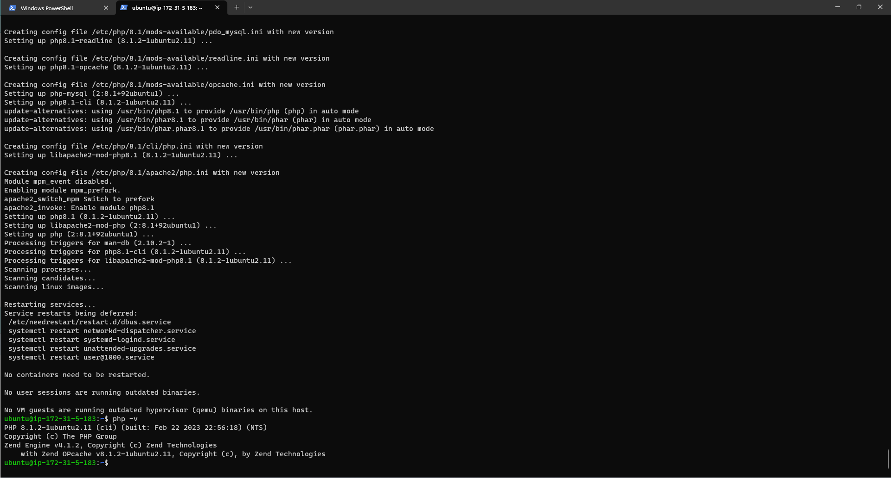

### Creating Virtual Host using Apache

`sudo mkdir /var/www/projectlamp`

`sudo chown -R $USER:$USER /var/www/projectlamp`

`sudo vi /etc/apache2/sites-available/projectlamp`

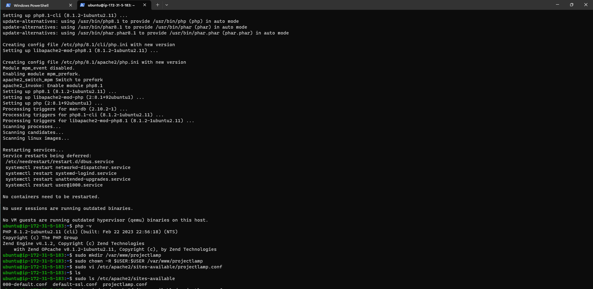
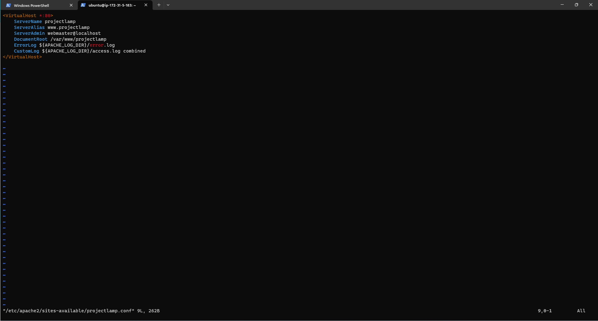

`sudo ls /etc/apache2/sites-available`

`sudo a2ensite projectlamp`

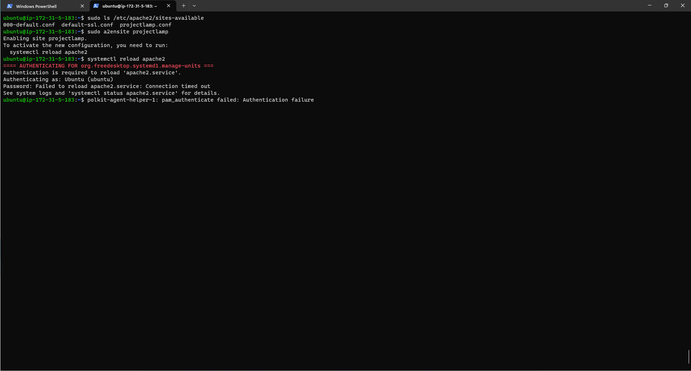

`sudo a2dissite 000-default`

`sudo apache2ctl configtest`

`sudo systemctl reload apache2`

`sudo echo 'Hello LAMP from hostname' $(curl -s http://169.254.169.254/latest/meta-data/public-hostname) 'with public IP' $(curl -s http://169.254.169.254/latest/meta-data/public-ipv4) > /var/www/projectlamp/index.html`

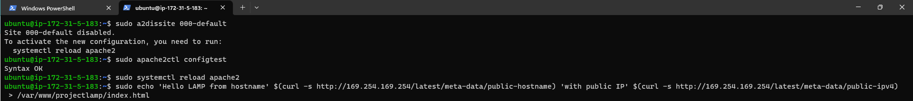

`http://3.15.149.37:80`

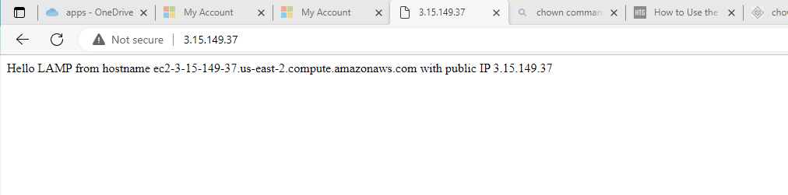

`sudo vim /etc/apache2/,mods-enabled/dir.conf`

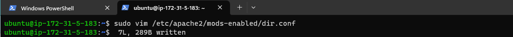

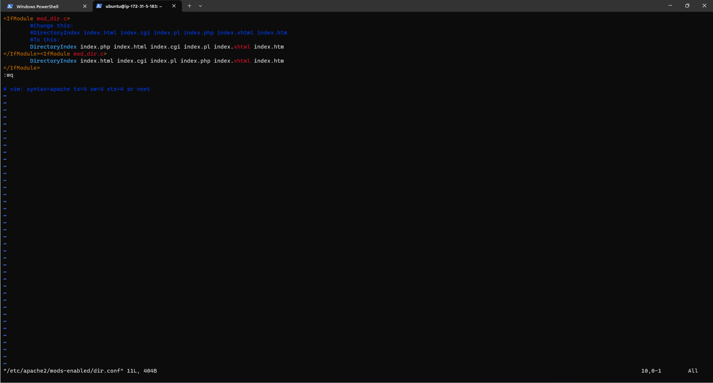

`sudo systemctl reload apache2`

`vim /var/www/projectlamp/index.php`

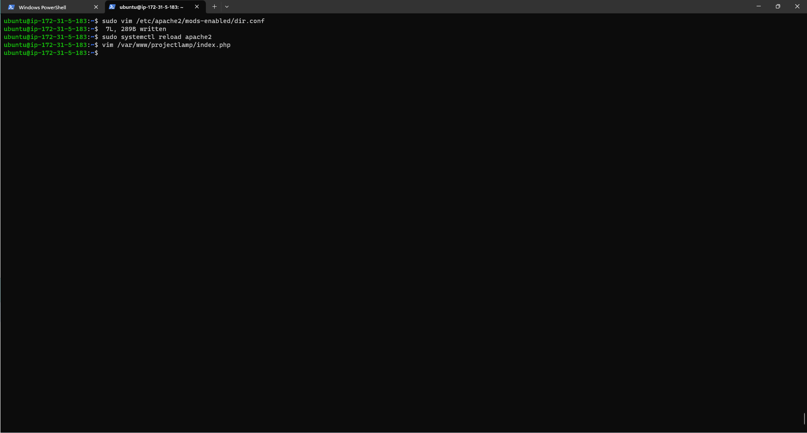
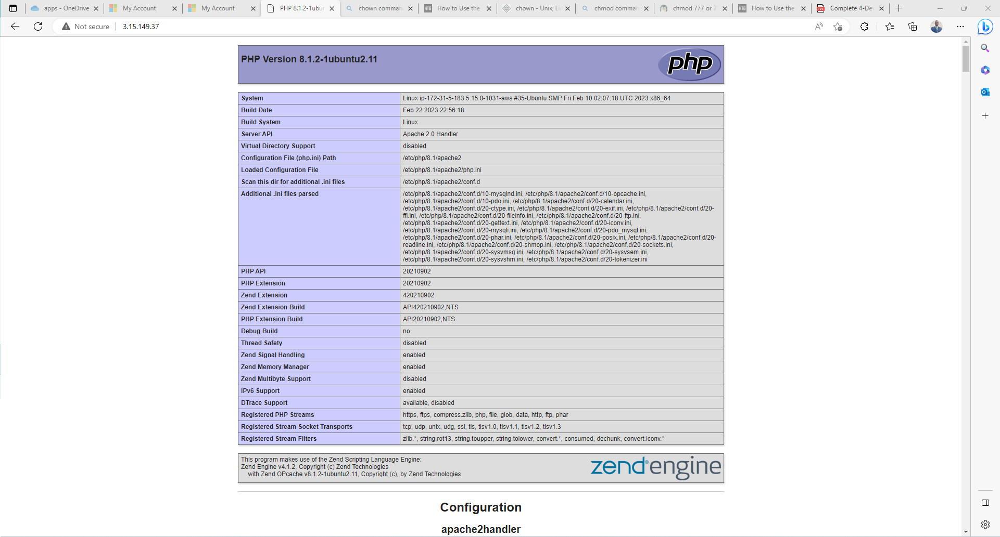
